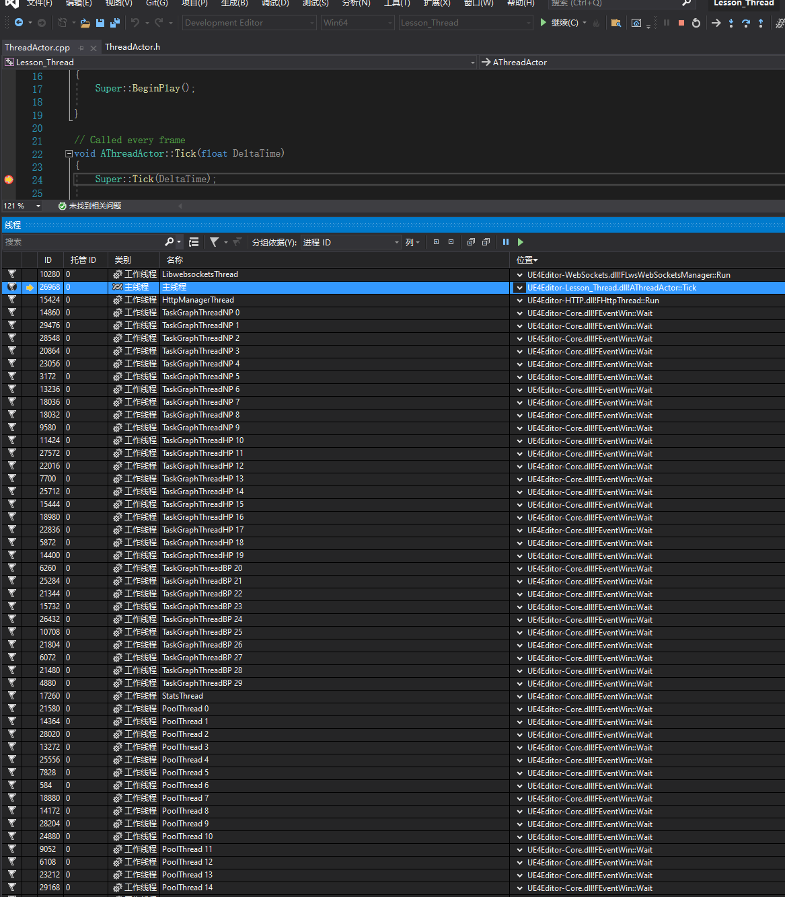

# 虚幻的线程
 
这里介绍一些常见的线程，来作为性能分析和代码原理理解使用

## 虚幻的线程的创建流程

进程启动，cpu都会执行其main函数，当然虚幻也不例外，在源代码的Engine\Source\Runtime\Launch目录里有各个平台的专属启动代码，一般是初始化完各平台的环境参数后就开始调用了公共部分的Launch.cpp中的GuardedMain函数进行虚幻自己的启动流程，其中就包含创建各种线程:  


## NamedThread

TaskGraph可以使用枚举值ENamedThreads中的线程名来指定线程执行任务，这些线程分别是:  
1. GameThread即游戏线程，主线程，主要是来处理整个大的流程和更新游戏逻辑
2. RenderingThread即渲染线程，主要在游戏线程完成计算任务后重绘进行处理和优化
3. RHIThread单例即渲染硬件接口线程，主要为渲染线程进行异步底层图像API调用
4. StatsThread主要进行统计数据的收集
5. AudioThread主要进行声音相关的处理

## TaskGraphThread

开头图片中名为TaskGraphThread的线程，即虚幻创建专门给TaskGraph系统使用的工作线程，当创建TaskGraph任务时使用ENamedThreads::Type::AnyThread就可以使用这些工作线程来执行任务

## QueuedThreadPool

开头的图片中的PoolThread即传统意义上的线程池，实际对应的类型为QueuedThreadPool，由虚幻引擎根据cpu核心数来创建对应数量的线程来等待和执行队列上的任务

## 普通自定义线程

传统意义上的线程，由用户自己创建和定义任务，比如虚幻里的FRunable

## TaskGraph的例子

1. TaskGraph是虚幻提供的并行编程框架，可以给创建的任务指定顺序和之间的依赖，即所谓的任务图
2. 创建的任务可以指定给TaskGraphThread工作线程或者上面所讲的有名线程中执行
3. 官方提供的便捷函数AsyncTask如下，可以指定线程来执行任务:  
    ``` c++
	// Engine\Source\Runtime\Core\Private\Async\Async.cpp
	void AsyncTask(ENamedThreads::Type Thread, TUniqueFunction<void()> Function)
	{
		TGraphTask<FAsyncGraphTask>::CreateTask().ConstructAndDispatchWhenReady(Thread, MoveTemp(Function));
	}
	```

4. 所以我们可以直接通知游戏线程:
	``` c++
    AsyncTask(ENamedThreads::GameThread, [ErrorMsg]() {
		UE_LOG(LogTemp, Error, TEXT("tcp socket thread exit: %s"), ErrorMsg);
	});
	```
5. 这里是官方代码中对任务定义的例程:  
	``` c++
	// 位置在Engine\Source\Runtime\Core\Public\Async\TaskGraphInterfaces.h
	class FGenericTask
	{
		TSomeType	SomeArgument;
	public:
		FGenericTask(TSomeType InSomeArgument) // CAUTION!: Must not use references in the constructor args; use pointers instead if you need by reference
		: SomeArgument(InSomeArgument)
		{
			// Usually the constructor doesn't do anything except save the arguments for use in DoWork or GetDesiredThread.
		}
		~FGenericTask()
		{
			// you will be destroyed immediately after you execute. Might as well do cleanup in DoWork, but you could also use a destructor.
		}
		FORCEINLINE TStatId GetStatId() const
		{
			RETURN_QUICK_DECLARE_CYCLE_STAT(FGenericTask, STATGROUP_TaskGraphTasks);
		}

		[static] ENamedThreads::Type GetDesiredThread()
		{
			return ENamedThreads::[named thread or AnyThread];
		}
		void DoTask(ENamedThreads::Type CurrentThread, const FGraphEventRef& MyCompletionGraphEvent)
		{
			// The arguments are useful for setting up other tasks. 
			// Do work here, probably using SomeArgument.
			MyCompletionGraphEvent->DontCompleteUntil(TGraphTask<FSomeChildTask>::CreateTask(NULL,CurrentThread).ConstructAndDispatchWhenReady());
		}
	};
	```
6. 这是我们定义的Something任务内容，代码里必须提供DoTask()函数，该函数会被GetDesiredThread()所返回的指定线程所运行，这里的AnyThread指的是任意的TaskGraph工作线程，GetSubsequentsMode()主要是针对是否存在后续任务，尽量使用TrackSubsequents来表示会存在后续任务，因为FireAndForget表示没有后续任务，但会容易因为使用了后续任务的相关操作而导致出现空指针或者其他错误:  
    
	``` c++
	// Something任务
	class FTask_Something {

	public:
		FTask_Something(const FString& InArg, FTaskDelegate_OnSomethingDone TaskDelegate)
			: InArg(InArg)
			, TaskDelegate(TaskDelegate) {
		}

		// TGraphTask的TTask模板类型中需要实现如下4个函数
		FORCEINLINE  TStatId GetStatId() const { RETURN_QUICK_DECLARE_CYCLE_STAT(FTask_Something, STATGROUP_TaskGraphTasks); }
		static ENamedThreads::Type GetDesiredThread() { return ENamedThreads::AnyThread; }
		static ESubsequentsMode::Type GetSubsequentsMode() { return ESubsequentsMode::TrackSubsequents; } // FireAndForget 会导致后续任务的依赖关系失败
		void DoTask(ENamedThreads::Type CurrentThread, const FGraphEventRef& Subsequents) {

			FString OutResult = FString::Printf(TEXT("Input is %s, so something is done !!!"), *InArg);
			Subsequents->DontCompleteUntil(TGraphTask<class FTask_OnSomethingDone>::CreateTask(nullptr, CurrentThread).ConstructAndDispatchWhenReady(MoveTemp(OutResult), TaskDelegate)); 
	}

	private:
		FString InArg;
		FTaskDelegate_OnSomethingDone TaskDelegate;
	};
	```
6. 这里是分配任务
	``` c++
	void AThreadActor::K2_TaskGraph_AsyncDoSomething(const FString& InArg) {
		FTaskDelegate_OnSomethingDone TaskDelegate;

		TaskDelegate.BindUObject(this, &AThreadActor::K2_TaskGraph_OnSomethingDone);

		TGraphTask<class FTask_Something>::CreateTask(nullptr, ENamedThreads::AnyThread).ConstructAndDispatchWhenReady(InArg, TaskDelegate);	// 创建和分配任务
	}

	```

7. 稍微复杂的任务关系可以参考本章的项目，几个任务之间存在互相依赖，其中Shared指针是防止ctx对象过早被销毁导致的悬空指针:  
   
	``` c++
	void AThreadActor::K2_TaskGraph_AsyncForkJoin(const FString& InArg) {
		TSharedPtr<FTaskContext> Ctx(new FTaskContext);
		Ctx->bRunning = true;
		Ctx->InArg = InArg;
		Ctx->TaskDelegate.BindUObject(this, &AThreadActor::K2_TaskGraph_OncForkJoinDone);

		auto TaskMain1 = TGraphTask<FTask_ForkJoinMain1>::CreateTask(nullptr, ENamedThreads::AnyThread).ConstructAndDispatchWhenReady(Ctx);

		FGraphEventArray PreSub;
		PreSub.Add(TaskMain1);

		auto TaskSub1 = TGraphTask<FTask_ForkJoinSub1>::CreateTask(&PreSub, ENamedThreads::AnyThread).ConstructAndDispatchWhenReady(Ctx);
		auto TaskSub2 = TGraphTask<FTask_ForkJoinSub2>::CreateTask(&PreSub, ENamedThreads::AnyThread).ConstructAndDispatchWhenReady(Ctx);

		FGraphEventArray PreMain;
		PreMain.Add(TaskSub1);
		PreMain.Add(TaskSub2);

		auto TaskMain2 = TGraphTask<FTask_ForkJoinMain2>::CreateTask(&PreMain, ENamedThreads::AnyThread).ConstructAndDispatchWhenReady(Ctx);
	}
	```


## AsyncTask的例子

1. 官方的自动销毁例子:  
   ``` c++
	/**
	位置: Engine\Source\Runtime\Core\Public\Async\AsyncWork.h
	FAutoDeleteAsyncTask - template task for jobs that delete themselves when complete
	**/
	class ExampleAutoDeleteAsyncTask : public FNonAbandonableTask
	{
		friend class FAutoDeleteAsyncTask<ExampleAutoDeleteAsyncTask>;

		int32 ExampleData;

		ExampleAutoDeleteAsyncTask(int32 InExampleData)
		 : ExampleData(InExampleData)
		{
		}

		void DoWork()
		{
			... do the work here
		}

		FORCEINLINE TStatId GetStatId() const
		{
			RETURN_QUICK_DECLARE_CYCLE_STAT(ExampleAutoDeleteAsyncTask, STATGROUP_ThreadPoolAsyncTasks);
		}
	};

	
	void Example()
	{
		// start an example job
		(new FAutoDeleteAsyncTask<ExampleAutoDeleteAsyncTask>(5)->StartBackgroundTask();

		// do an example job now, on this thread
		(new FAutoDeleteAsyncTask<ExampleAutoDeleteAsyncTask>(5)->StartSynchronousTask();
	}

	```  
2. 官方的手动销毁例子:  
   
	``` c++
	/**
	FAsyncTask - template task for jobs queued to thread pools

	Sample code:
	**/
	class ExampleAsyncTask : public FNonAbandonableTask
	{
		friend class FAsyncTask<ExampleAsyncTask>;

		int32 ExampleData;

		ExampleAsyncTask(int32 InExampleData)
		 : ExampleData(InExampleData)
		{
		}

		void DoWork()
		{
			... do the work here
		}

		FORCEINLINE TStatId GetStatId() const
		{
			RETURN_QUICK_DECLARE_CYCLE_STAT(ExampleAsyncTask, STATGROUP_ThreadPoolAsyncTasks);
		}
	};

	void Example()
	{

		//start an example job

		FAsyncTask<ExampleAsyncTask>* MyTask = new FAsyncTask<ExampleAsyncTask>( 5 );
		MyTask->StartBackgroundTask();

		//--or --

		MyTask->StartSynchronousTask();

		//to just do it now on this thread
		//Check if the task is done :

		if (MyTask->IsDone())
		{
		}

		//Spinning on IsDone is not acceptable( see EnsureCompletion ), but it is ok to check once a frame.
		//Ensure the task is done, doing the task on the current thread if it has not been started, waiting until completion in all cases.

		MyTask->EnsureCompletion();
		delete Task;
	}

	```
3. 我们的例子:

	``` c++
	
	// ============== 自动删除的任务 ===================
	class FAutoDelTask : public  FNonAbandonableTask {

	public:
		FAutoDelTask(const FString& InName, FTaskDelegate_OnAutoDelAsyncTaskDone TaskDelegate)
			: Name(InName)
			, TaskDelegate(TaskDelegate) {
		}

		~FAutoDelTask(){}

		// 需提供如下2个函数
		void DoWork() {
			FPlatformProcess::Sleep(2);

			auto TaskDelegateCopied = this->TaskDelegate;
			auto NameCopied = this->Name;

			AsyncTask(ENamedThreads::GameThread, [TaskDelegateCopied, NameCopied]() {
				TaskDelegateCopied.ExecuteIfBound(FString::Printf(TEXT("Finish task: %s"), *NameCopied));
			});
		}

		FORCEINLINE TStatId GetStatId() const { RETURN_QUICK_DECLARE_CYCLE_STAT(FAutoDelTask, STATGROUP_ThreadPoolAsyncTasks); }

	private:
		friend class FAutoDeleteAsyncTask<FAutoDelTask>;
		FString Name;
		FTaskDelegate_OnAutoDelAsyncTaskDone TaskDelegate;
	};


	// ============== 需要手动删除的任务 ===================
	class FManualDelTask : public  FNonAbandonableTask {

	public:
		FManualDelTask(const FString& InName, FTaskDelegate_OnManualDelAsyncTaskDone TaskDelegate)
			: Name(InName)
			, TaskDelegate(TaskDelegate) {
		}

		~FManualDelTask() {}

		// 需提供如下2个函数
		void DoWork() {
			FPlatformProcess::Sleep(2);

			auto TaskDelegateCopied = this->TaskDelegate;
			auto NameCopied = this->Name;
			UE_LOG(LogTemp, Log, TEXT("do work"));
		
			AsyncTask(ENamedThreads::GameThread, [TaskDelegateCopied, NameCopied]() {
				TaskDelegateCopied.ExecuteIfBound(FString::Printf(TEXT("Finish task: %s"), *NameCopied));
			});
		
			return;
		}

		FORCEINLINE TStatId GetStatId() const { RETURN_QUICK_DECLARE_CYCLE_STAT(FManualDelTask, STATGROUP_ThreadPoolAsyncTasks); }

	private:
		friend class FAsyncTask<FManualDelTask>;
		FString Name;
		FTaskDelegate_OnManualDelAsyncTaskDone TaskDelegate;
	};

	```
   
## FRunable的例子
